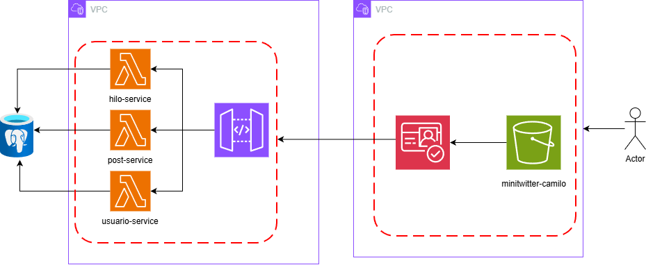

# 🏛️ MiniTwitter – Microservicios en AWS Lambda

## 📄 Resumen del Proyecto

Este proyecto corresponde al Taller de Arquitectura Empresarial, donde se implementa una **aplicación web tipo Twitter** con una arquitectura moderna basada en **microservicios** desplegados en **AWS Lambda**. El sistema incluye autenticación JWT y un frontend JavaScript interactivo.

La solución está compuesta por:

* **Backend:** Tres microservicios independientes (Usuarios, Hilos, Posts) desarrollados en Java (Spring Boot), expuestos como funciones Lambda y orquestados por API Gateway.
* **Frontend:** Aplicación JS estática desplegada en S3, disponible en: [MiniTwitter S3](http://minitwitter-camilo.s3-website-us-east-1.amazonaws.com)

---

## 🏗️ Arquitectura del Sistema

**Diagrama general:**



La arquitectura implementa una aplicación de microservicios desplegada en AWS, donde el usuario interactúa con un frontend estático alojado en S3 (minitwitter-camilo). El frontend se autentica mediante AWS Cognito, que proporciona tokens JWT con información del usuario (email, username, cognito:username). Todas las peticiones del cliente pasan a través de un API Gateway que actúa como punto de entrada único y enruta las solicitudes hacia tres microservicios implementados como funciones Lambda: hilo-service (gestión de hilos), post-service (gestión de publicaciones) y usuario-service (autenticación y gestión de usuarios). Estos tres microservicios están desplegados en un VPC y comparten acceso a una base de datos común (RDS/DynamoDB) donde persisten la información de hilos, posts y usuarios. API Gateway valida los tokens JWT de Cognito antes de invocar las funciones Lambda, asegurando que solo usuarios autenticados puedan acceder a los recursos protegidos.
---

## 🔐 Configuración JWT

La autenticación se implementa usando **JSON Web Tokens (JWT)**. El backend incluye:

* **Generación de tokens:** Al iniciar sesión, el usuario recibe un JWT firmado.
* **Validación:** Los endpoints protegidos verifican el token usando filtros personalizados (`JwtAuthFilter`, `SecurityConfig`).
* **Configuración:**
  - El secreto y parámetros del JWT se definen en el backend (`application.properties` y clases de seguridad).
  - El frontend almacena el token en localStorage y lo envía en el header `Authorization: Bearer <token>`.

---

## 🌐 Frontend JS en S3

1. Se desarrolló una aplicación JS que permite:

* Registro y login de usuarios.
* Creación y visualización de hilos y posts.
* Consumo de los microservicios vía fetch.

2. Subimos los archivos de nuestra aplicación a S3:


Como se puede evidenciar en la imagen, subimos el archivo .html, .js y .css de nuestro front.


**URL pública:** [http://minitwitter-camilo.s3-website-us-east-1.amazonaws.com](http://minitwitter-camilo.s3-website-us-east-1.amazonaws.com)

---

## 📦 Endpoints Principales

* **Usuarios:**
  - `GET /usuarios` – Listar usuarios
  - `POST /usuarios` – Crear usuario

* **Hilos:**
  - `GET /hilos` – Listar hilos
  - `POST /hilos` – Crear hilo (requiere JWT)

* **Posts:**
  - `GET /hilos/{hiloId}/posts` – Listar posts de un hilo
  - `POST /hilos/{hiloId}/posts` – Crear post 

---

## ⚙️ Instrucciones de Implementación

### ✅ Requisitos

* Java 17 y Maven
* PostgreSQL
* Cuenta AWS con permisos Lambda y S3

---

### 🧩 Ejecución local

1. Clonar el repositorio:
	```powershell
	git clone https://github.com/Sebs2807/AREP-Taller7.git
	cd AREP-Taller7
	```
2. Compilar y ejecutar backend:
	```powershell
	mvn clean package -DskipTests
	mvn spring-boot:run
	```
3. Probar endpoints en Postman:
	```
	POST http://localhost:3000/usuarios
	POST http://localhost:3000/auth/login
	```

---

## 🛠 Tecnologías Utilizadas

| Tecnología                  | Descripción                                    |
| --------------------------- | ---------------------------------------------- |
| **AWS Lambda**              | Backend serverless para microservicios         |
| **Spring Boot**             | Framework Java para REST y seguridad           |
| **JWT**                     | Autenticación y autorización                  |
| **PostgreSQL (NeonDB)**     | Base de datos relacional en la nube            |
| **AWS S3**                  | Hosting estático para frontend JS              |
| **API Gateway**             | Orquestación y routing de APIs                 |
| **AWS SAM**                 | Infraestructura como código y despliegue       |
| **JavaScript**              | Frontend dinámico y consumo de APIs            |

---

## 📸 Pruebas y Capturas

* Registro y login de usuarios

  Nos registramos con un usuario del pool de usuarios de Cognito:

  


  
* Creación de hilos y posts

Creando un Hilo


Vemos que se crea de forma correcta


Creando un Post


Vemos que se crea de forma correcta


  
* Acceso público al frontend JS desde s3

Accediendo desde el link que nos proporciona s3, vemos que la aplicación funciona correctamente


  

---

### Microservicios

- Empaquetamos cada microservicio como un "shaded" JAR usando `maven-shade-plugin`. Los artefactos finales que se suben a Lambda son los JAR grandes en `target/` los cuales tienen por dentro los archivos .class de las clases java compiladas y las dependencias necesarias usadas por spring boot y escritas en el POM. 
- Homogeneizamos la compilación a Java 17 para los tres módulos (para usar runtime Java 17 en Lambda y evitar incompatibilidades).
- Solucionamos errores de inicio en Lambda relacionados con clases faltantes añadiendo dependencias que habían sido excluidas indirectamente (entre las más relevantes: ByteBuddy y soporte JWT de Spring Security).

Servicios empaquetados (ejemplos de rutas generadas):

- `hilo-service`: target/hilo-service-lambda.jar
- `post-service`: target/post-service.jar
- `usuario-service`: target/usuario-service.jar

### Despliegue

1. Construir cada servicio:

Para esto nos dirijimos al directorio raiz de cada microservicio (donde está ubicado el POM) y ejecutamos el siguiente comando:
```powershell
mvn clean package
```

2. Verificar contenido del JAR (asegurarnos de que las clases necesarias estén incluidas):

Este comando lo que nos permite es ver el contenido del JAR, esto nos ayudó a detectar errores de dependencias faltantes o empaquetamientos mal hechos por usar el empaquetador de spring.
```powershell
jar tf target/<<archivo.jar>>
```

3. Subir/actualizar la función Lambda:

Para subir el codigo a AWS Lambda se carga el mismo archivo JAR directamente o se puede subir a un bucket s3 y de ahí a las funciones lambda si el archivo es muy pesado, para este caso los subimos directamente a Lambda

Esto se repitió para los 3 microservicios.

## Por qué esta arquitectura (microservicios + Lambda) y qué cambia respecto a un monolito

- Ventajas de microservicios en Lambda:
	- Deploy independiente: cada servicio se empaqueta y despliega por separado. Si cambia la lógica de Usuarios no afecta a Hilos ni Posts.
	- Escalado automático: Lambda escala cada función según la demanda, puediendo asignar memoria/CPU por función.
	- Costos por uso: Se paga por ejecución (billed duration) en lugar de tener instancias siempre activas al ser una función serverless.

- Lo que cambia frente a un monolito:
	- Comunicación: en microservicios se necesita diseñar APIs y (si aplica) una capa de gateway; en un monolito todo está en la misma JVM y las llamadas son locales, más simples pero menos aisladas.
	- Complejidad operativa: más despliegues, más IAM/roles, monitoreo y tracing entre servicios. En monolito la operativa es más sencilla inicialmente.
	- Fallas parciales: en microservicios un fallo afecta solo el servicio malo si está bien aislado; en monolito un fallo puede tirar toda la app.

En resumen: para proyectos que necesiten alta escalabilidad es bueno usar una infraestructura por microservicios, aunque si es un proyecto pequeño no tanto porque agrega complejidad de despliegues e infraestructura como autenticación para cada microservicio, roles, VPC y demás.


## 🎥 Video de Implementación

https://youtu.be/BeSUwblZcsg


## 📚 Documentación y Referencias

* [AWS Lambda + Java](https://docs.aws.amazon.com/lambda/latest/dg/java-handler.html)
* [Spring Boot + JWT](https://spring.io/guides/gs/securing-web/)
* [AWS SAM](https://docs.aws.amazon.com/serverless-application-model/latest/developerguide/what-is-sam.html)
* [Spring Security OAuth2 / JWT](https://spring.io/guides/tutorials/spring-security-and-oauth2/)
* [Maven Shade Plugin](https://maven.apache.org/plugins/maven-shade-plugin/)


